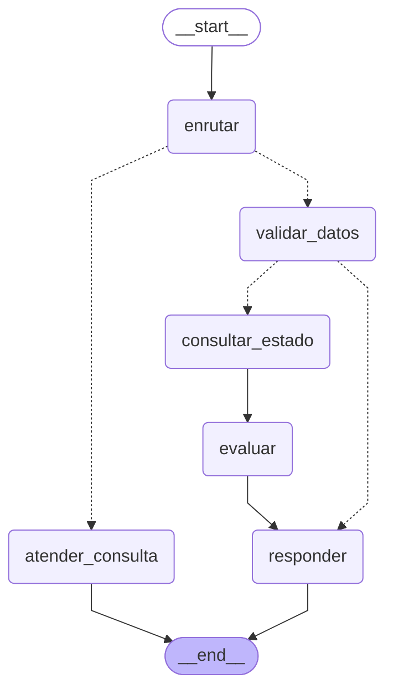

# Diagrama del workflow (generado por LangGraph)

```mermaid
---
config:
  flowchart:
    curve: linear
---
graph TD;
	__start__([<p>__start__</p>]):::first
	enrutar(enrutar)
	validar_datos(validar_datos)
	consultar_estado(consultar_estado)
	evaluar(evaluar)
	responder(responder)
	atender_consulta(atender_consulta)
	__end__([<p>__end__</p>]):::last
	__start__ --> enrutar;
	consultar_estado --> evaluar;
	enrutar -.-> atender_consulta;
	enrutar -.-> validar_datos;
	evaluar --> responder;
	validar_datos -.-> consultar_estado;
	validar_datos -.-> responder;
	atender_consulta --> __end__;
	responder --> __end__;
	classDef default fill:#f2f0ff,line-height:1.2
	classDef first fill-opacity:0
	classDef last fill:#bfb6fc
```
